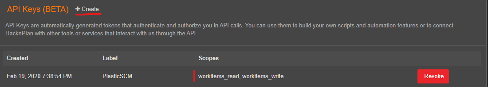

# PlasticSCM HacknPlan Extension
HacknPlan Issue Tracking extension for PlasticSCM

A very crude, quickly put together extension, using an experimental, beta version of HacknPlan public API. You have been warned.

## Installation

Build or [download](https://github.com/zment4/PlasticSCMHacknPlanExtension/releases/download/v0.1/PlasticSCMHacknPlanExtension.zip) the dll and copy `Newtonsoft.Json.dll` and `hacknplanextension.dll` to `C:\Program Files\PlasticSCM5\client\extensions\hacknplan`

After copying the dll files, modify `C:\Program Files\PlasticSCM5\client\customextensions.conf` and add the line 
```
HacknPlan=extensions/hacknplan/hacknplanextension.dll
```

Now when you open PlasticSCM you should be able to choose HacknPlan from the Preferences->Issue trackers configuration page. In case there is a configuration file error or the dll's don't work correctly, PlasticSCM kindly informs us of not being able to initialize the extension.

## Configuration

The most important settings are API Secret, Project Id and perhaps the Pending Tasks Stage Id. Without API Secret and Project Id you can't connect to HacknPlan at all. You can get a HacknPlan API in **Account Settings->API**. The API keys are account bound.


Request a new API key with Create, and remember to give at least workitem_read permission. If you want to use the PlasticSCM feature of setting the issue open after creating a branch, you can give the API key also workitem_write permission as well. In this case you need to also set the stage id for open tasks.



Set the API Secret and Project Id on the configuration screen of PlasticSCM, and click Test Connection. If the connection was succesfull, you'll get message box with your username and userId.


On the configuration screen you can setup some variables that affect the usage of the extension. Pending Tasks Stage Id is the id of the stage tasks are in that are ready to be started work on (Planned) and Open Tasks Stage Id is the id of the stage that PlasticSCM sets the issue as after creating the branch - if the Mark as open in issue tracker has been toggled on (In Progress). For me those were 5 and 6, respectively, I don't know if that is the standard or not.

Lastly, there are a couple of ignore configuration options. These are still fetched from the HacknPlan API, as it doesn't support more complex filtering options, and are therefore filtered by the extension itself. You can choose to ignore issues in the Backlog, and you can also add a comma separated list of boardId's that you don't want to add to the Pending Tasks list (that is shown when creating a new branch).
